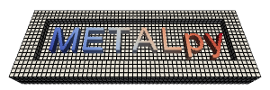

<h1 align="center">

</h1>

-------------

**METAL Essential Tools and Libraries (Python)**，简称**metalpy**，
是用于SimPEG以及相关工作流的通用Python工具集，目前包含：
1. MEPA: 一个通用并行化框架
2. [Mexin](metalpy/mexin/README.zh_CN.md): 一个Python注入框架
3. [SCAB](metalpy/scab/README.zh_CN.md): SimPEG相关实用工具和扩展

安装
------------
metalpy可以通过pip安装：

```console
pip install metalpy
```

<details><summary><b>使用pip安装注意事项</b></summary>
<p>

metalpy包含针对SimPEG的扩展SCAB，像这样使用`pip`进行安装时*不会*安装SCAB相关的额外依赖：

```console
pip install metalpy
```

其他支持的安装参数包括：

```console
pip install "metalpy[scab]"      # 额外安装SCAB模块需要的依赖
pip install "metalpy[tests]"     # 安装测试需要的依赖
pip install "metalpy[docs]"      # 安装文档生成需要的依赖
pip install "metalpy[complete]"  # 安装全部可选依赖
pip install "metalpy[dev]"       # 安装开发所需依赖
```

</p>
</details>
